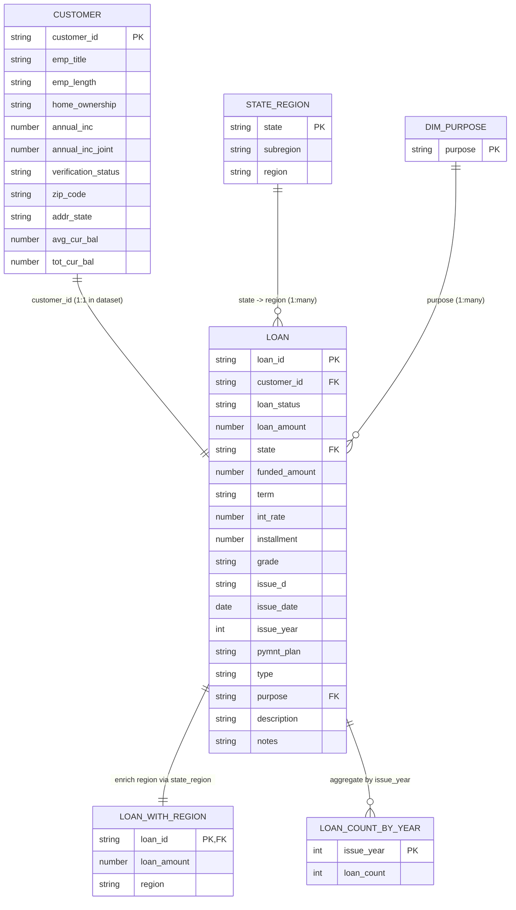

# BigQuery Fintech Data Profiling (FA-style) — Master Scorecard + Evidence Pack

This repository is a **Functional Analyst–style** data profiling / data quality pack for a fintech-like dataset
It focuses on **repeatable SQL checks**, **clear scorecard definitions**, and **human-readable evidence docs** (ready to extend into RDT mapping).

## Scope boundary

- **Phase A:** data profiling, validation rules, integrity checks, exception listing, evidence docs `docs/profiling/`
- **Phase B:** RDT-style "mocked" `docs/rdt/`

---

## Master Scorecard (Summary)

> Definitions (used consistently across this repo):  
> **Missing** = NULL / blank after trimming • **Mismatched** = violates a locked rule / expected domain • **Valid** = total − missing − mismatched  
> **Unique** = distinct count of normalized values • **Most Common** = mode value + share

| Asset | Grain (what 1 row means) | Primary checks (scorecard style) | What this helps prove | Evidence |
|---|---|---|---|---|
| `raw.customers` | 1 row per `customer_id` | Missing/format checks on identifiers, enum drift checks on categorical fields, numeric sanity checks | Customer reference quality + stable join key for loan analysis | `docs/01_customers_profiling.md` |
| `raw.loans` | 1 row per `loan_id` | PK health (missing/dupes), domain checks (status / term / purpose), numeric range checks (amount / interest-like fields), cross-field consistency | Transaction-like table integrity + safe for downstream reconciliation | `docs/02_loans_profiling.md` |
| `raw.loan_count_by_year` | 1 row per `issue_year` | Year domain, non-negative counts, continuity/sanity of time series | Trend series is structurally safe (YoY / charting) | `docs/03_loan_count_by_year.md` |
| `raw.loan_purposes` | 1 row per allowed `purpose` | Enum list quality (trim/duplicates/case), “reference list is stable” checks | Reference table is usable for validation + mapping | `docs/04_loan_purposes.md` |
| `raw.loan_with_region` | 1 row per `loan_id` | PK health, region domain checks, numeric sanity checks | Enriched reporting table is consistent with source loans | `docs/05_loan_with_region_profiling.md` |
| `raw.state_region` | 1 row per `state` | State code format checks, subregion/region domain checks, uniqueness + mapping completeness | Geography mapping table is reliable for enrichment | `docs/06_state_region.md` |

customer card

|column_name        |total_rows|valid_cnt|valid_pct|mismatched_cnt|mismatched_pct|missing_cnt|missing_pct|unique_cnt|unique_pct|most_common_cnt|most_common_pct|most_common_value|
|-------------------|----------|---------|---------|--------------|--------------|-----------|-----------|----------|----------|---------------|---------------|-----------------|
|customer_id        |    270299|   270299|   100.00|             0|          0.00|          0|       0.00|    270299|    100.00|              1|           0.00|b'' xfa:xf8)"x...|
|emp_title          |    270299|   246641|    91.25|             0|          0.00|      23658|       8.75|     83483|     33.85|           4966|           1.84|Teacher          |
|emp_length         |    270299|   251554|    93.07|             0|          0.00|      18745|       6.93|        11|      0.00|          88549|          32.76|10+ years        |
|home_ownership     |    270299|   270299|   100.00|             0|          0.00|          0|       0.00|         6|      0.00|         133354|          49.34|MORTGAGE         |
|verification_status|    270299|   270299|   100.00|             0|          0.00|          0|       0.00|         3|      0.00|         105373|          38.98|source verified  |
|zip_code           |    270299|   270299|   100.00|             0|          0.00|          0|       0.00|       887|      0.33|           2897|           1.07|750xx            |
|addr_state         |    270299|   270299|   100.00|             0|          0.00|          0|       0.00|        51|      0.02|          37024|          13.70|CA               |

|column_name     |total_rows|valid_cnt|valid_pct|mismatched_cnt|mismatched_pct|missing_cnt|missing_pct|mean     |std     |min     |p25     |p50      |p75      |max      |
|----------------|----------|---------|---------|--------------|--------------|-----------|-----------|---------|--------|--------|--------|---------|---------|---------|
|annual_inc      |    270299|   270212|    99.97|            87|          0.03|          0|       0.00| 78821.95|53349.81|   34.00|47300.00| 66000.00| 95000.00|998000.00|
|annual_inc_joint|    270299|    18785|     6.95|             9|          0.00|     251505|      93.05|129787.74|70034.20|15400.00|86588.00|115000.00|154000.00|960000.00|
|avg_cur_bal     |    270299|   270299|   100.00|             0|          0.00|          0|       0.00| 13668.80|16753.98|    0.00| 3107.00|  7376.00| 18921.50|623229.00|

loan card

|unique_pct|most_common_cnt|most_common_pct|most_common_value|
|-----------|----------|---------|---------|--------------|--------------|-----------|-----------|----------|----------|---------------|---------------|-----------------|
|loan_id    |    270299|   270299|   100.00|             0|          0.00|          0|       0.00|    270299|    100.00|              1|           0.00|1                |
|customer_id|    270299|   270299|   100.00|             0|          0.00|          0|       0.00|    270299|    100.00|              1|           0.00|b'' xfa:xf8)"x...|
|loan_status|    270299|   270299|   100.00|             0|          0.00|          0|       0.00|         7|      0.00|         170461|          63.06|Current          |
|state      |    270299|   270299|   100.00|             0|          0.00|          0|       0.00|        51|      0.02|          37024|          13.70|CA               |
|term       |    270299|   270299|   100.00|             0|          0.00|          0|       0.00|         2|      0.00|         189772|          70.21|36 months        |
|grade      |    270299|   270299|   100.00|             0|          0.00|          0|       0.00|         7|      0.00|          79072|          29.25|B                |

|column_name  |total_rows|valid_cnt|valid_pct|mismatched_cnt|mismatched_pct|missing_cnt|missing_pct|mean    |std    |min    |p25    |p50     |p75     |max     |
|-------------|----------|---------|---------|--------------|--------------|-----------|-----------|--------|-------|-------|-------|--------|--------|--------|
|loan_amount  |    270299|   270299|   100.00|             0|          0.00|          0|       0.00|15412.83|9459.78|1000.00|8000.00|13200.00|20300.00|40000.00|
|funded_amount|    270299|   270299|   100.00|             0|          0.00|          0|       0.00|15412.83|9459.78|1000.00|8000.00|13200.00|20300.00|40000.00|
|int_rate     |    270299|   270299|   100.00|             0|          0.00|          0|       0.00|    0.13|   0.05|   0.05|   0.09|    0.13|    0.16|    0.31|
|installment  |    270299|   270299|   100.00|             0|          0.00|          0|       0.00|  453.92| 272.34|  29.52| 256.04|  383.96|  605.12| 1719.83|

|column_name|total_rows|valid_cnt|valid_pct|mismatched_cnt|mismatched_pct|missing_cnt|missing_pct|
|-----------|----------|---------|---------|--------------|--------------|-----------|-----------|
|issue_year |         8|        8|   100.00|             0|          0.00|          0|       0.00|
|loan_count |         8|        8|   100.00|             0|          0.00|          0|       0.00|

loan with region card

|column_name|total_rows|valid_cnt|valid_pct|mismatched_cnt|mismatched_pct|missing_cnt|missing_pct|unique_cnt|unique_pct|most_common_cnt|most_common_pct|most_common_value|
|-----------|----------|---------|---------|--------------|--------------|-----------|-----------|----------|----------|---------------|---------------|-----------------|
|loan_id    |    270299|   270299|   100.00|             0|          0.00|          0|       0.00|    270299|    100.00|              1|           0.00|1                |
|region     |    270299|   270299|   100.00|             0|          0.00|          0|       0.00|         4|      0.00|          97683|          36.14|South            |

state region card

|column_name|total_rows|valid_cnt|valid_pct|mismatched_cnt|mismatched_pct|missing_cnt|missing_pct|unique_cnt|unique_pct|most_common_cnt|most_common_pct|most_common_value|
|-----------|----------|---------|---------|--------------|--------------|-----------|-----------|----------|----------|---------------|---------------|-----------------|
|state      |        52|       51|    98.08|             1|          1.92|          0|       0.00|        52|    100.00|              1|           1.92|AK               |
|subregion  |        52|       51|    98.08|             1|          1.92|          0|       0.00|        10|     19.23|              9|          17.31|South Atlantic   |
|region     |        52|       51|    98.08|             1|          1.92|          0|       0.00|         5|      9.62|             17|          32.69|South            |
---

## Quick links

- Dataset overview: `docs/00_about_dataset.md`
- Customers scorecard: `docs/01_customers_profiling.md`
- Loans scorecard: `docs/02_loans_profiling.md`
- Loan count by year: `docs/03_loan_count_by_year.md`
- Loan purposes reference: `docs/04_loan_purposes.md`
- Loan with region (enriched): `docs/05_loan_with_region_profiling.md`
- State → Subregion → Region mapping: `docs/06_state_region.md`

---

## How to run (BigQuery)

1) Load source files into a BigQuery dataset (recommended dataset name: `raw`)
2) Run SQL checks in `sql/` (table-by-table)
3) Review findings and interpretations in `docs/`

Recommended order (mirrors the docs):
- `sql/customers_profiling.sql`
- `sql/loans_profiling.sql`
- `sql/loan_with_region_profiling.sql`
- `sql/loan_count_by_year_profiling.sql`
- `sql/loan_purposes_profiling.sql`
- `sql/state_region_profiling.sql`

---

## ERD (Entity Relationship Diagram)

This ERD captures the **minimum join paths** and the **derived/reporting layer** tables used in this repo.
Key points:
- `CUSTOMER` → `LOAN` is treated as **joinable via `customer_id`** (dataset behaves like 1:1 per customer in this training set)
- `STATE_REGION` enriches loans from `state` to reporting `region`
- `DIM_PURPOSE` is a reference list to validate and standardize `purpose`
- `LOAN_WITH_REGION` and `LOAN_COUNT_BY_YEAR` are **derived/reporting** assets built from `LOAN`

---

