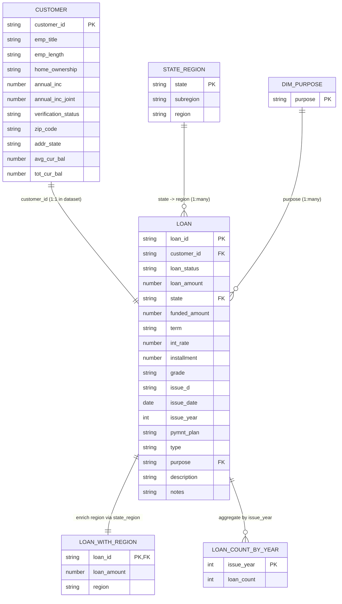

## Scope

This repository demonstrates **two deliverables** for a fintech-like dataset in a Functional Analyst (FA) style:

**A) Data Profiling (SQL-first)**  
A reproducible SQL profiling/validation pack (completeness, duplicates, domain checks, and FK-like integrity) with evidence-ready documentation.

**B) RDT-like Documentation (Mocked)**  
A set of regulator-style documents (RDT-lite) to showcase a regulatory data transformation mindset:
- **A:** Validation Rules (Mock)  
- **B:** Data Entities (DER-like Overview)  
- **C:** Reporting Guidelines (RDT-lite)

---

## Quick links

### Phase A — Profiling evidence
- Dataset overview: `docs/profiling/00_about_dataset.md`
- Customers scorecard: `docs/profiling/01_customers_profiling.md`
- Loans scorecard: `docs/profiling/02_loans_profiling.md`
- Loan count by year: `docs/profiling/03_loan_count_by_year.md`
- Loan purposes reference: `docs/profiling/04_loan_purposes.md`
- Loan with region (enriched): `docs/profiling/05_loan_with_region_profiling.md`
- State → Subregion → Region mapping: `docs/profiling/06_state_region.md`

### Phase B — RDT-like (Mocked) docs
- A) Validation Rules (Mock): `docs/rdt/A_*.md`
- B) Data Entities (DER-like): `docs/rdt/B_*.md`
- C) Reporting Guidelines: `docs/rdt/C_*.md`

---

## ERD (Entity Relationship Diagram)

This ERD captures the **minimum join paths** and the **derived/reporting layer** tables used in this repo.
Key points:
- `CUSTOMER` → `LOAN` is treated as **joinable via `customer_id`** (dataset behaves like 1:1 per customer in this training set)
- `STATE_REGION` enriches loans from `state` to reporting `region`
- `DIM_PURPOSE` is a reference list to validate and standardize `purpose`
- `LOAN_WITH_REGION` and `LOAN_COUNT_BY_YEAR` are **derived/reporting** assets built from `LOAN`

---

